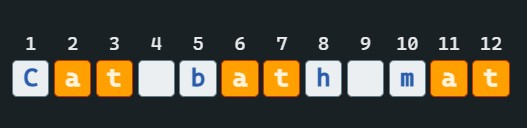
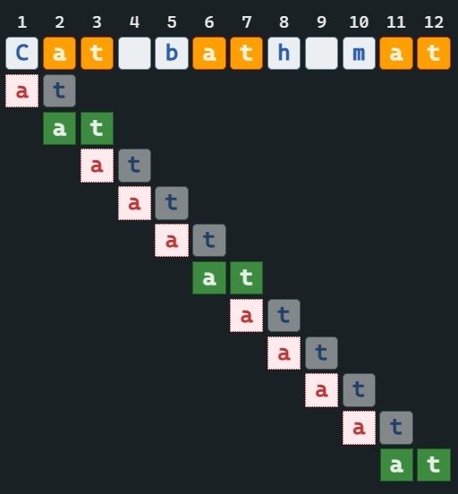
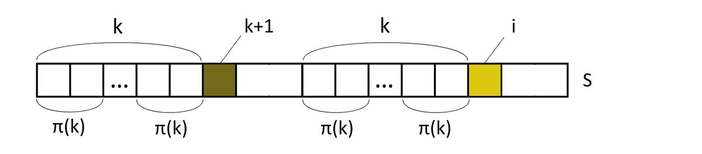
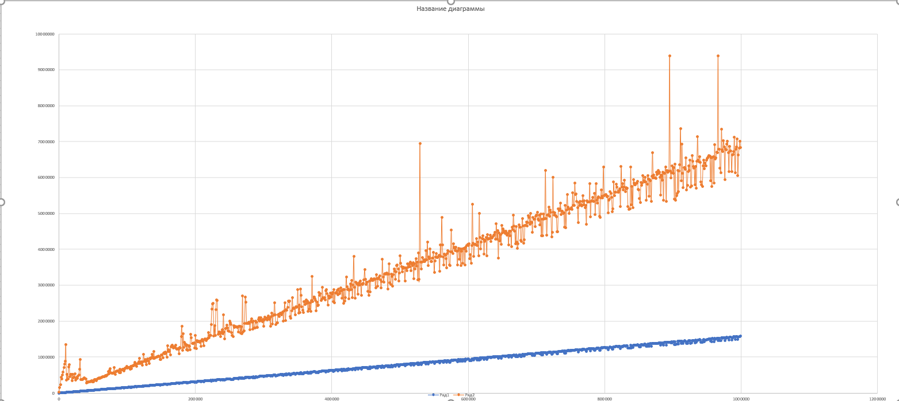

# Семестровая работа по АиСД. Выполнил: Гайфуллин Азамат, группа 11-205.
___

Прежде чем углубиться в детали, давайте разберёмся, что происходит при поиске вхождения образа (подстроки) в строке наивным алгоритмом.



В данной строке будем искать вхождения образа "at"

Наивный алгоритм будет проходить по каждому символу строки, сравнивая образ со строкой. 



Вроде бы всё хорошо, но представим другой случай:


В этом примере никогда не будет совпадения, но наивный алгоритм этого не видит. В наихудшем случае сложность этого алгоритма будет O(n*m), где n - длина данной строки, а m - длина образа.

## Алгоритм Кнута-Морриса-Пратта (реализация с помощью префикс-функции)

Подстрока ***X*** называется ***префиксом*** строки ***Y***, если есть такая (непустая) подстрока ***Z***, что ***Y=XZ***. Например, подстрока ***ab*** является префиксом строки ***abcfa***.

Подстрока ***X*** называется ***суффиксом*** строки **Y**, если есть такая подстрока (непустая) ***Z***, что ***Y=ZX***. Например, подстрока ***fa*** является суффиксом строки ***abcfa***.

Бордер - длина максимального префикса, который также является максимальным суффиксом. Например, для строки **abracadabra** бордером будет **abra**, длина которого равна 4.

Префикс-функция (англ. prefix-function) от строки — массив длин наибольших бордеров для каждой позиции этой строки.
Область определения функции - все строки, область значений - массивы неотрицательных целых чисел.
Будем считать, что символы в строках нумеруются с 0.
Определим префикс-функцию от строки s
в позиции i следующим образом: p(s,i)=max{k:s[0…k−1]=s[i−k+1…i]}, где k=1…i. Если мы не нашли такого k, то  p(s,i)=0.

Как наивно построить этот алгоритм?
Проходимся по всем индексам строки, проходимся по префиксам, сравниваем префикс и суффикс на совпадение.

Псевдокод:
``` 
int[] prefixFunction(string s):
    int[] p = int[s.length]
    fill(p, 0) // заполняем массив нулями
    for i = 0 to s.length - 1
        for k = 0 to i - 1
            if s[0..k] == s[i - k..i]
                p[i] = k
    return p
```
**Время работы**
Всего O(n^2) итераций цикла, на каждой из который происходит сравнение строк за O(n), что дает в итоге O(n^3).
___
## Эффективный алгоритм.

### Лемма 1.

Заметим, что `p[i+1]` не более чем на 1 больше `p[i]`.

Док-во:
Пусть `p[i+1] > p[i+1] + 1`, тогда рассмотрим суффикс в позиции `i+1`, длина которого `p[i + 1]`. Удалим из него последний символ,
тогда получим `p[i+1] - 1 > p[i]`, **противоречие.**

### Лемма 2.
Избавимся от явных сравнений строк. Пусть мы вычислили `p[i]`, тогда, если `s[i+1]=s[p[i]]`, то `p[i+1]=p[i]+1`. 
Если окажется, что `s[i+1]≠s[p[i]]`, то нужно попытаться попробовать подстроку меньшей длины. Хотелось бы сразу перейти к
такому бордеру наибольшей длины, для этого подберем такое `k`, что `k=p[i]−1`. Делаем это следующим образом. За исходное
`k` необходимо взять `p[i−1]`, что следует из первого пункта. В случае, когда символы `s[k]` и `s[i]` не совпадают, `p[k−1]` — 
следующее потенциальное наибольшее значение `k`, что видно из рисунка. Последнее утверждение верно, пока `k>0`, что позволит
всегда найти его следующее значение. Если `k=0`, то `p[i]=1` при `s[i]=s[1]`, иначе `p[i]=0`.


___
### Напишем этот алгоритм префикс-функции на языке Java:


```java
import java.util.Arrays;
import java.util.Scanner;

public class Main {
    public static void main(String[] args) {
        Scanner in = new Scanner(System.in);
        String string = in.nextLine();
        System.out.println(Arrays.toString(prefixFunction(string)));
    }

    public static int[] prefixFunction(String string) {
        int n = string.length();
        int k;
        //создадим массив, он будет заполнен нулями.
        int[] p = new int[n];
        p[0] = 0;
        for (int i = 1; i < string.length(); i++) {
            k = p[i-1];
            while (k > 0 && string.charAt(i)!=string.charAt(k)){
                k = p[k-1];
            }
            if (string.charAt(i) == string.charAt(k)){
                k++;
            }
            p[i] = k;
        }
        return p;
    }
}
```

Например, Для строки ***abracadabra*** префикс-функцией будет массив **p = [0, 0, 0, 1, 0, 1, 0, 1, 2, 3, 4]**.

Работа этого алгоритма в худшем случае `O(n)` Давайте посмотрим, что происходит с `k`. Когда переходим с одной итерации на следующую,
`p[i] = k`, а  `k = p[i-1]`. То есть `k++`. Таких увеличений может быть максимум `n`. А где `k` уменьшается? Оно уменьшается, 
когда попадает в `while` и становится `k = p[k-1]`. В этом месте `k` уменьшается хотя бы на единицу. В конечном итоге `k = n - x >= 0`, где 
`x <= n ` - сколько раз прошли `while`.


### KMP

Принцип работы алгоритма
1) Вычислить префикс-функцию для образца (в дальнейшем последовательность pi). Объявить две
   дополнительные переменные для хранения индексов позиции в строке и подстроке
   соответственно (в дальнейшем і и j). Присвоить j значение индекса первого элемента. Перейти к
   пункту 2.
2) Проверяем совпадение символов на і позиции в строке и на j позиции в подстроке.
   • Символы совпадают. Перейти к пункту 3.
   • Символы не совпадают. Перейти к пункту 4.
3) Если j равен индексу последнего символа подстроки заканчиваем алгоритм (поиск успешен). В
   противном случае увеличить і и j на единицу и перейти к пункту 2.
4) Выполняем проверку индексов і и j.
   • Индекс і равен или больше индекса последнего символа строки закончить алгоритм (поиск
   неудачен).
   • Индекс j равен индексу первого символа в подстроке, то увеличить значение і на единицу и
   перейти к пункту 2.
   • Индекс j не равен индексу первого символа в подстроке. В таком случае установить значение j
   = pi[j-1] перейти к пункту 2.
___
## График
С помощью файла Onotation.java делаем .csv файл, с помощью полученных данных строим графики.

Зависимость времени выполнения алгоритма(нс) от размера вводной строки(Оранжевый). График n(синий).

___

## Что почитать/посмотреть по теме?

1) [Лекция Павла Маврина, университет ИТМО.](https://youtu.be/bH45DuZjBWw)
2) [Лекция с ФИЗТЕХА ФПМИ.](https://youtu.be/eIt9R094GM8)
3) [ВИДЕО: Алгоритмы. Поиск подстроки. Алгоритм Кнута — Морриса - Пратта](https://youtu.be/Vncv1JbOVwg)
4) [Вики конспекты университета ИТМО](https://neerc.ifmo.ru/wiki/index.php?title=%D0%90%D0%BB%D0%B3%D0%BE%D1%80%D0%B8%D1%82%D0%BC_%D0%9A%D0%BD%D1%83%D1%82%D0%B0-%D0%9C%D0%BE%D1%80%D1%80%D0%B8%D1%81%D0%B0-%D0%9F%D1%80%D0%B0%D1%82%D1%82%D0%B0)
5) [Алгоритмы на Java. Глава 5, параграф 3.](https://vk.com/wall-54530371_505)
